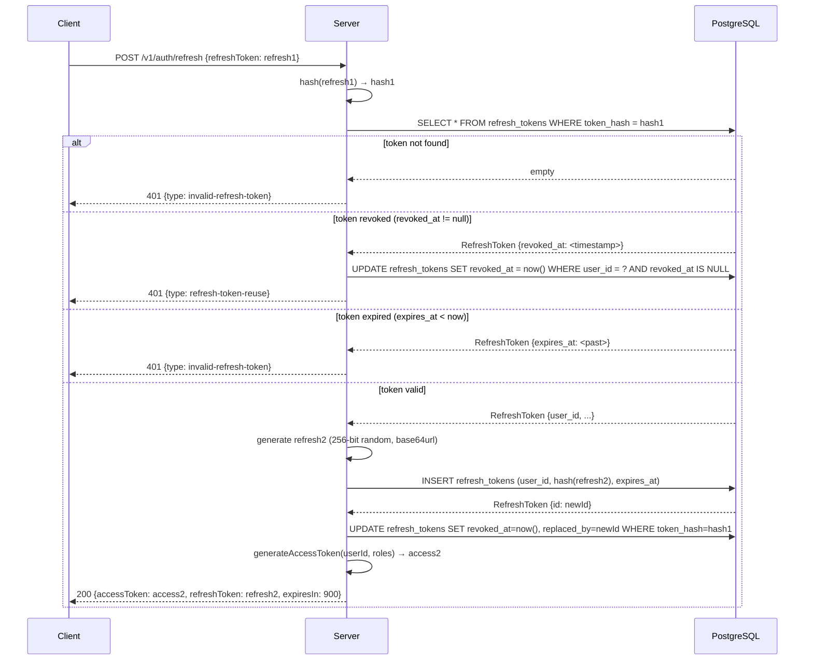

# Refresh Token Rotation Flow

**US-005** — Token rotation with reuse detection.

## Security Model

- Each `/refresh` call issues a **new** access token + **new** refresh token
- The **old** refresh token is immediately revoked (`revoked_at` set, `replaced_by` pointing to new)
- If a **revoked** token is presented again → all tokens for that user are revoked (chain compromise)
- Expired tokens → 401, must re-login via `/login`

## Sequence Diagram



## DB Schema (V2 migration)

```
refresh_tokens
├── id           UUID PK
├── user_id      UUID FK → users.id (ON DELETE CASCADE)
├── token_hash   VARCHAR(255) UNIQUE  ← SHA-256, never plaintext
├── expires_at   TIMESTAMP
├── revoked_at   TIMESTAMP NULL       ← set on revocation
├── replaced_by  UUID NULL FK → refresh_tokens.id  ← forensic chain
└── created_at   TIMESTAMP
```

## Security Notes

- Token is stored as SHA-256 hash, never plaintext
- On reuse detection, ALL active tokens for that user are revoked (not just the reused one)
- `replaced_by` chain allows forensic trace of token lineage
- BCrypt not used for refresh token hash (high-entropy random → SHA-256 sufficient)
